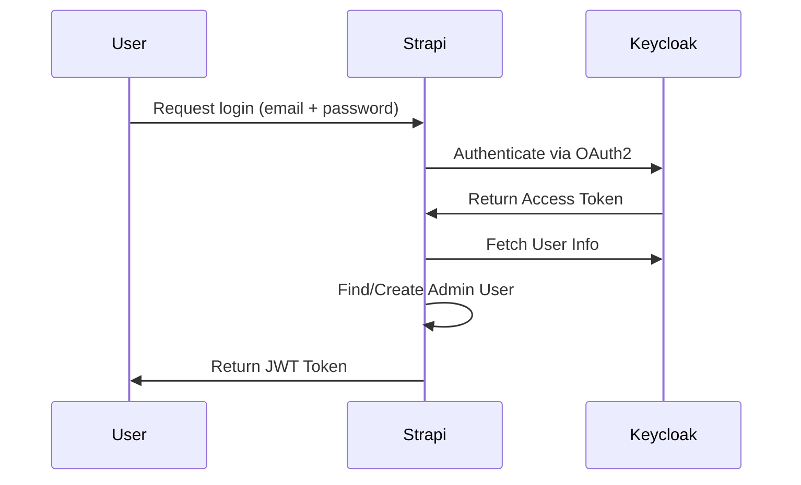

# 🔑 Strapi Keycloak Passport Plugin
🚀 **Seamlessly integrate Keycloak authentication with Strapi Admin Panel.**  
💼 **Enterprise-grade security, role-based access control (RBAC), and streamlined authentication.**  

## ✨ Features
✅ **🔐 Single Sign-On (SSO)** – Replace Strapi's default admin login with Keycloak authentication.  
✅ **🛡️ Role Mapping** – Dynamically map Keycloak roles to Strapi admin roles.  
✅ **⚡ Auto-Assign Default Role** – Ensure a default role (`STRAPI_ADMIN → Super Admin`) exists at first-time activation.  
✅ **🔍 Strapi RBAC Integration** – Leverage Strapi's native **Roles & Permissions** to enforce admin access.  
✅ **💾 Persistent Admin Session** – No redundant authentication; login once, persist across requests.  
✅ **📜 Full Logging & Debugging** – Logs every authentication & authorization event.  

---

## 📦 Installation
```bash
yarn add @sonatel/strapi-keycloak-passport
```
or
```bash
npm install @sonatel/strapi-keycloak-passport
```

---

## ⚙️ Configuration
### 🔹 `config/plugins.js`
Add the following entry inside your `config/plugins.js` file:

```javascript
module.exports = ({ env }) => ({
  'strapi-keycloak-passport': {
    enabled: env('KEYCLOAK_PASSPORT_ACTIVE', true),
    config: {
      KEYCLOAK_AUTH_URL: env('KEYCLOAK_PASSPORT_AUTH_URL', 'https://keycloak.example.com/auth'),
      KEYCLOAK_REALM: env('KEYCLOAK_PASSPORT_REALM', 'master'),
      KEYCLOAK_CLIENT_ID: env('KEYCLOAK_PASSPORT_CLIENT_ID', 'strapi-admin'),
      KEYCLOAK_CLIENT_SECRET: env('KEYCLOAK_PASSPORT_CLIENT_SECRET', 'your-secret'),
      KEYCLOAK_TOKEN_URL: env('KEYCLOAK_PASSPORT_TOKEN_URL', '/token'),
      KEYCLOAK_USERINFO_URL: env('KEYCLOAK_PASSPORT_USERINFO_URL', '/userinfo'),
      roleConfigs: {
        defaultRoleId: env('KEYCLOAK_PASSPORT_DEFAULT_ROLE_ID', 5),
        excludedRoles: env('KEYCLOAK_PASSPORT_EXZIL_ROLES', [
          'uma_authorization',
          'default-roles-centralisedcms',
          'offline_access',
          'VIEWER',
        ]),
      },
    },
    resolve: '../strapi-keycloak-passport',
  },
});
```
✅ **This configuration:**  
- **Enables or disables** the plugin via `KEYCLOAK_PASSPORT_ACTIVE`.  
- Connects to Keycloak using **client credentials** (`KEYCLOAK_CLIENT_ID`, `KEYCLOAK_CLIENT_SECRET`).  
- Defines **RBAC mappings**, excluding irrelevant Keycloak roles from syncing.  
- **Auto-assigns a default role** (`defaultRoleId`) if no mapping exists.  

---

## 🛠 Setup in Keycloak
### 1️⃣ Create a Client
- **Go to Keycloak Admin Panel** → `Clients`
- **Create New Client**:  
  - `Client ID`: `strapi-admin`
  - `Access Type`: **Confidential**
  - `Root URL`: `https://your-strapi-instance.com/admin`
- **Save the client**, then go to the **Credentials** tab and copy:
  - `Client Secret`
  - `Client ID`
  
### 2️⃣ Configure Admin Roles
- **Go to** `Roles` → `Create Role`
  - Role: `STRAPI_ADMIN` (This will map to **Strapi Super Admin** by default)
- Assign this role to **Keycloak users who should have Strapi Super Admin access**.

---

## 🔐 Role-Based Access Control (RBAC)
Strapi Keycloak Passport Plugin **respects Strapi's native RBAC system**.  
It maps **Keycloak roles to Strapi admin roles**.

### 🛠 Managing Role Mappings
1️⃣ **Go to**: `Admin Panel → Keycloak Plugin`  
2️⃣ **Map Keycloak roles** to Strapi admin roles.  
3️⃣ **Save the mapping.**  

🔄 **Example Mapping:**

| Keycloak Role       | Strapi Role       |
|---------------------|------------------|
| `STRAPI_ADMIN`      | `Super Admin (1)` |
| `EDITOR`           | `Editor (2)`      |
| `VIEWER`           | `Viewer (3)`      |

### 📌 How Role Mapping Works
✅ If a Keycloak user logs in with `STRAPI_ADMIN`, they get **Super Admin** rights in Strapi.  
✅ If no role mapping exists, they get **assigned the default role** (`KEYCLOAK_PASSPORT_DEFAULT_ROLE_ID`).  

---

## 🔄 Authentication Flow



✅ **Admin logs in once** → session persists, no re-authentication needed on every request.  

---

## 📜 API Endpoints
| Method | Endpoint | Description | Auth Required |
|--------|---------|-------------|--------------|
| `POST` | `/admin/login` | Authenticate admin via Keycloak | ❌ No |
| `GET` | `/keycloak-roles` | Fetch available Keycloak roles | ✅ Yes |
| `GET` | `/get-keycloak-role-mappings` | Get saved role mappings | ✅ Yes |
| `POST` | `/save-keycloak-role-mappings` | Save new role mappings | ✅ Yes |

---

## 🚀 Next-Level Security
| Feature | Status |
|---------|--------|
| ✅ OAuth2 Authentication | ✔ Enabled |
| ✅ Session-Based Persistence | ✔ Secure |
| ✅ Role-Based Access Control (RBAC) | ✔ Strapi Admin Integration |
| ✅ Middleware Protection | ✔ Only Authorized Users Access APIs |

---

## 🎯 Final Command to Rule Them All
```bash
yarn develop
```
🔥 **Your Strapi is now fully Keycloak-powered!** 🔥  
